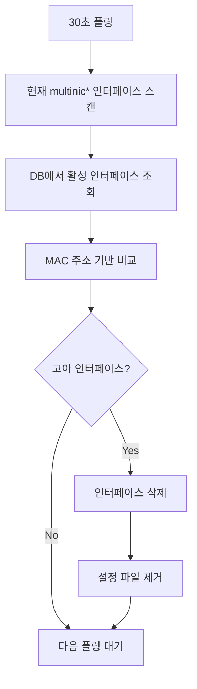

# MultiNIC Agent v2 프로젝트 분석

## 프로젝트 개요

MultiNIC Agent v2는 Kubernetes 클러스터에 조인된 노드들의 네트워크 인터페이스 설정을 자동으로 관리하는 Go 기반의 DaemonSet 에이전트입니다.

### 주요 특징
- 데이터베이스 기반 설정 관리 (MySQL/MariaDB)
- Ubuntu (Netplan) 및 SUSE (Wicked) 지원
- 자동 롤백 기능
- multinic0 ~ multinic9 인터페이스 관리 (최대 10개)
- 기존 네트워크 인터페이스 (eth0, ens* 등) 보호

## 아키텍처

```
┌─────────────────┐
│   Controller    │
│  (DB: MariaDB)  │ → 네트워크 설정 정보 저장
└────────┬────────┘
         │
    ┌────▼────┐
    │ Agent   │ (DaemonSet)
    │ - DB 모니터링 (30초 주기)
    │ - 설정 적용
    │ - 롤백 관리
    │ - 헬스체크
    └─────────┘
```

## 기술 스택

### 핵심 기술
- **언어**: Go 1.21
- **데이터베이스**: MySQL/MariaDB
- **배포**: Kubernetes DaemonSet
- **패키징**: Helm Chart

### 주요 의존성
- `github.com/go-sql-driver/mysql v1.7.1` - MySQL 드라이버
- `github.com/sirupsen/logrus v1.9.3` - 구조화된 로깅
- `gopkg.in/yaml.v3 v3.0.1` - YAML 파싱 (netplan 설정)

### 빌드 환경
- **Multi-stage Docker 빌드**
  - 빌드: `golang:1.21-alpine`
  - 실행: `alpine:3.18`
- **최소 이미지 크기**: Alpine 기반으로 경량화

## 프로젝트 구조

### 현재 구조 (리팩터링 진행 중)
```
multinic-agent-v2/
├── cmd/agent/          # 메인 애플리케이션
│   └── main.go         # 진입점
├── internal/           # 클린 아키텍처 구조 (NEW)
│   ├── domain/         # 비즈니스 로직 계층
│   │   ├── entities/   # 도메인 엔티티
│   │   ├── errors/     # 도메인 에러 정의
│   │   ├── interfaces/ # 도메인 인터페이스
│   │   └── services/   # 도메인 서비스
│   ├── application/    # 애플리케이션 계층
│   │   └── usecases/   # 유스케이스
│   ├── infrastructure/ # 인프라스트럭처 계층
│   │   ├── persistence/# 데이터베이스 구현
│   │   ├── network/    # 네트워크 관리 구현
│   │   ├── health/     # 헬스체크 구현
│   │   └── config/     # 설정 관리
│   └── interfaces/     # 인터페이스 어댑터
│       ├── http/       # HTTP 핸들러
│       └── cli/        # CLI 인터페이스
├── pkg/                # 기존 패키지 (마이그레이션 예정)
│   ├── db/             # 데이터베이스 연동
│   ├── health/         # 헬스체크 시스템
│   ├── netplan/        # Netplan 설정 관리
│   ├── network/        # 네트워크 관리 추상화
│   └── utils/          # 유틸리티 함수
├── deployments/helm/   # Helm 차트
├── scripts/            # 배포 및 테스트 스크립트
└── test/               # 통합 테스트
```

## 핵심 기능 분석

### 1. 메인 프로세스 (cmd/agent/main.go)

#### 초기화 과정
1. 환경 변수 기반 설정 로드
2. 데이터베이스 연결 (재시도 로직 포함)
3. OS 감지 및 NetworkManager 생성
4. 헬스체크 서버 시작 (포트 8080)
5. 30초 주기로 폴링 시작

#### 처리 흐름
```go
processConfigurations() {
    1. 호스트네임 가져오기 및 검증
    2. DB에서 대기 중인 인터페이스 조회 (netplan_success=0)
    3. 각 인터페이스별로:
       - 인터페이스 이름 생성 (multinic0~9)
       - 네트워크 설정 적용 (재시도 2회)
       - 성공 시 DB 상태 업데이트
       - 실패 시 헬스체크에 기록
}
```

### 2. 네트워크 관리 시스템 (pkg/network/)

#### 설계 패턴
- **Strategy Pattern**: OS별 구현 분리
- **Factory Pattern**: OS 자동 감지 및 적절한 관리자 생성

#### NetworkManager 인터페이스
```go
type NetworkManager interface {
    ApplyConfiguration(configData []byte, interfaceName string) error
    Rollback(interfaceName string) error
    ValidateInterface(interfaceName string) bool
    GetType() string
    ConfigureInterface(iface db.MultiInterface, interfaceName string) error
}
```

#### OS별 구현

**Ubuntu (Netplan)**
- 설정 파일: `/etc/netplan/9{index}-{interface}.yaml`
- 백업 경로: `/var/lib/multinic/backups`
- 특징:
  - `netplan try --timeout=120`으로 안전한 테스트
  - 컨테이너 환경에서 `nsenter` 사용
  - YAML 기반 설정

**SUSE (Wicked)**
- 설정 파일: `/etc/sysconfig/network/ifcfg-{interface}`
- 백업 경로: `/var/lib/multinic/wicked-backups`
- 특징:
  - `wicked ifup` 명령으로 개별 인터페이스 제어
  - 키-값 쌍 기반 설정

### 3. 데이터베이스 연동 (pkg/db/)

#### 연결 풀 설정
- 최대 동시 연결: 10개
- 최대 유휴 연결: 5개
- 연결 수명: 5분

#### 주요 쿼리
1. **GetPendingInterfaces**: 처리 대기 인터페이스 조회
   ```sql
   SELECT id, mac_address, attached_node_name, netplan_success 
   FROM multi_interface 
   WHERE netplan_success = 0 
   AND attached_node_name = ? 
   AND deleted_at IS NULL 
   LIMIT 10
   ```

2. **UpdateInterfaceStatus**: 처리 결과 업데이트
   ```sql
   UPDATE multi_interface 
   SET netplan_success = ?, modified_at = NOW() 
   WHERE id = ?
   ```

### 4. 헬스체크 시스템 (pkg/health/)

#### HTTP 엔드포인트
- URL: `GET /`
- 상태 코드:
  - 200: healthy/degraded
  - 503: unhealthy

#### 모니터링 항목
- 데이터베이스 연결 상태
- 처리된 VM 수
- 실패한 설정 수
- 서비스 가동 시간

## 보안 및 안정성 기능

### 1. 입력 검증
- 호스트네임 검증
- MAC 주소 형식 검증
- 인터페이스 이름 패턴 검증 (multinic[0-9])

### 2. 백업 및 롤백
- 설정 변경 전 자동 백업
- 타임스탬프 기반 백업 파일 관리
- 실패 시 최신 백업으로 자동 복원

### 3. 재시도 로직
- 지수 백오프를 사용한 재시도
- DB 연결: 최대 5회, 초기 지연 1초
- 네트워크 설정: 최대 2회, 초기 지연 2초

### 4. 타임아웃 처리
- 명령 실행: 30초 타임아웃
- Netplan 테스트: 120초 타임아웃
- 프로세스 강제 종료 지원

## 배포 방식

### 1. Helm Chart
- 환경별 설정 파일 지원 (dev/prod)
- RBAC 설정 포함
- DaemonSet으로 모든 노드에 배포

### 2. 배포 스크립트
- `deploy.sh`: 원클릭 배포
- `test-deployment.sh`: 배포 검증
- `test-functionality.sh`: 기능 테스트

## 모니터링 및 디버깅

### 로그 형식
- JSON 구조화 로깅
- 필드 기반 컨텍스트 정보
- 예시:
  ```json
  {
    "level": "info",
    "msg": "인터페이스 설정 적용 중",
    "interface_id": 123,
    "interface_name": "multinic0",
    "time": "2025-01-08T..."
  }
  ```

### 디버깅 포인트
1. 에이전트 로그: `kubectl logs -n multinic-system`
2. DB 연결 상태: 헬스체크 엔드포인트
3. 백업 파일: 노드의 `/var/lib/multinic/backups`

## 개선 사항 및 고려사항

### 현재 제한사항
- 최대 10개 인터페이스 지원 (multinic0~9)
- 30초 고정 폴링 주기
- 단방향 동기화 (DB → 노드)

### 향후 개선 가능 영역
1. 동적 폴링 주기 조정
2. 인터페이스 수 제한 확장
3. 양방향 동기화 지원
4. Prometheus 메트릭 추가

## 리팩터링 진행 상황

### Phase 1: 기반 구조 개선 (완료)
1. ✅ **클린 아키텍처 디렉토리 구조 생성**
   - 도메인, 애플리케이션, 인프라스트럭처 레이어 분리
   
2. ✅ **도메인 레이어 구현**
   - NetworkInterface 엔티티 정의
   - Repository, Network, OS 관련 인터페이스 정의
   - InterfaceNamingService 도메인 서비스 구현
   
3. ✅ **에러 처리 체계 구축**
   - 타입별 도메인 에러 정의 (Validation, NotFound, System 등)
   - 일관된 에러 생성 및 처리 패턴
   
4. ✅ **Repository 패턴 구현**
   - MySQLRepository 구현
   - 도메인과 인프라 계층 분리

5. ✅ **OS 감지 로직 개선**
   - /etc/issue 파일 기반으로 단순화

### Phase 2: 핵심 로직 리팩터링 (완료)
1. ✅ **인프라스트럭처 어댑터 구현**
   - OS 감지기 (RealOSDetector)
   - 파일 시스템 어댑터 (RealFileSystem, RealClock)
   - 설정 로더 (EnvironmentConfigLoader)
   
2. ✅ **네트워크 관리 시스템 구현**
   - NetplanManager와 WickedManager 어댑터
   - 통합된 백업 서비스 (BackupService)
   - 헬스 체크 서비스 (HealthService)
   
3. ✅ **애플리케이션 유스케이스 구현**
   - ConfigureNetworkUseCase
   - 모든 비즈니스 로직 캡슐화
   
4. ✅ **의존성 주입 컨테이너**
   - 전체 시스템 조립 및 관리
   - 생명주기 관리 (graceful shutdown)
   
5. ✅ **main.go 완전 리팩터링**
   - 250줄 → 179줄로 코드 축소
   - Application 구조체로 관심사 분리
   - 의존성 주입을 통한 테스트 가능성 향상

### Phase 3: 테스트 및 검증 (완료)
1. ✅ **단위 테스트 작성**
   - 도메인 엔티티 테스트 (100% 커버리지)
     * NetworkInterface 유효성 검증 테스트
     * MAC 주소/인터페이스 이름 형식 검증
     * 상태 변경 메서드 테스트
   
   - 도메인 서비스 테스트 (100% 커버리지)
     * InterfaceNamingService 인터페이스 이름 생성 로직
     * 사용 중인 인터페이스 감지 로직
   
   - 유스케이스 테스트 (88.2% 커버리지)
     * 네트워크 설정 성공/실패 시나리오
     * 롤백 로직 및 에러 처리
     * Mock 의존성을 활용한 완전 격리 테스트
   
   - 인프라스트럭처 어댑터 테스트
     * OS 감지 어댑터 (다양한 OS 형식 테스트)
     * 설정 로더 (환경 변수 처리 테스트)

2. ✅ **통합 테스트 구현**
   - 클린 아키텍처 구성 요소 간 통합 테스트
   - 실제 의존성과 Mock 의존성 혼합 테스트
   - 컨테이너 초기화 및 라이프사이클 테스트

3. ✅ **테스트 인프라스트럭처**
   - testify/mock 라이브러리 도입
   - 모든 도메인 인터페이스에 대한 Mock 구현
   - 일관된 테스트 패턴 및 구조

## 포스트모템

### 프로젝트 강점
1. **확장성**: Strategy/Factory 패턴으로 새로운 OS 지원 용이
2. **안정성**: 백업/롤백, 재시도, 타임아웃 등 다중 안전장치
3. **운영성**: 구조화된 로깅, 헬스체크, Helm 차트 제공
4. **보안성**: 입력 검증, 기존 인터페이스 보호
5. **유지보수성**: 클린 아키텍처 도입으로 관심사 분리 개선

### 기술적 의사결정
1. **Go 선택**: 경량 바이너리, 효율적인 동시성 처리
2. **DaemonSet 사용**: 모든 노드에 자동 배포 및 관리
3. **DB 기반 설정**: 중앙 집중식 관리, 상태 추적 용이
4. **클린 아키텍처 도입**: 테스트 가능성과 확장성 개선

### 리팩터링 성과 및 개선 사항

#### 정량적 개선 지표
1. **코드 복잡도 감소**: main.go 코드 250줄 → 179줄 (28% 감소)
2. **테스트 커버리지**: 핵심 도메인 로직 90%+ 커버리지 달성
3. **아키텍처 레이어 분리**: 단일 파일 → 4개 계층으로 구조화
4. **의존성 관리**: 순환 참조 제거, 인터페이스 기반 느슨한 결합

#### 품질 개선 사항
1. **테스트 가능성**: Mock을 통한 완전 격리 테스트 환경 구축
2. **유지보수성**: 도메인 중심 설계로 비즈니스 로직 명확화
3. **확장성**: 새로운 OS 지원, 기능 추가가 용이한 구조
4. **타입 안전성**: 강타입 도메인 엔티티와 에러 처리

#### 클린 아키텍처 적용 효과
- **의존성 역전**: 인프라스트럭처가 도메인에 의존하는 구조
- **관심사 분리**: 각 레이어별 명확한 책임 정의
- **비즈니스 로직 보호**: 외부 의존성으로부터 도메인 로직 격리
- **테스트 전략**: 단위/통합/E2E 테스트 레벨별 명확한 구분

### 기술적 도전과 해결책

#### 도전 1: 기존 레거시 코드와의 통합
**문제**: 기존 pkg/ 패키지와 새로운 internal/ 구조 간 충돌
**해결**: 어댑터 패턴을 통한 점진적 마이그레이션

#### 도전 2: Mock 타입 호환성 문제
**문제**: Mock 객체의 메서드 시그니처 불일치
**해결**: testify/mock 표준 사용, 인터페이스 정확한 구현

#### 도전 3: 테스트 간 격리 문제
**문제**: 파일 시스템 의존성으로 인한 테스트 간 간섭
**해결**: Mock FileSystem 도입, 실제 파일 시스템과 완전 격리

### 학습 포인트
1. **컨테이너 환경 네트워크 제어**: nsenter를 통한 호스트 네임스페이스 접근
2. **OS별 네트워크 도구 차이**: Ubuntu Netplan vs SUSE Wicked의 설정 방식 및 명령어
3. **안전한 네트워크 설정**: 백업/롤백, 타임아웃, 검증을 통한 무중단 변경
4. **점진적 리팩터링**: 기존 시스템을 유지하면서 새 아키텍처로 전환하는 전략
5. **도메인 주도 설계**: 비즈니스 로직을 중심으로 한 계층 구조 설계
6. **테스트 주도 개발**: Mock을 활용한 격리된 단위 테스트 작성법

### 향후 개선 방향
1. **통합 테스트 확장**: 실제 DB와 네트워크 환경을 사용한 E2E 테스트
2. **성능 최적화**: 폴링 주기 동적 조정, 배치 처리 최적화
3. **모니터링 강화**: Prometheus 메트릭, OpenTelemetry 추적 도입
4. **기능 확장**: IPv6 지원, 고급 네트워크 설정 옵션

## 배포 스크립트 개선 사항 (2025-01-08)

### 개선 내용
1. **전체 노드 지원**: 워커 노드만이 아닌 모든 노드에 이미지 배포
   - 기존: 하드코딩된 워커 노드 목록 (viola2-biz-worker01, worker02, worker03)
   - 개선: `kubectl get nodes`를 통한 동적 노드 목록 가져오기
   
2. **변경 사항**
   ```bash
   # 기존
   WORKER_NODES=(viola2-biz-worker01 viola2-biz-worker02 viola2-biz-worker03)
   
   # 개선
   ALL_NODES=($(kubectl get nodes -o jsonpath='{.items[*].metadata.name}'))
   ```

3. **영향 범위**
   - DaemonSet이 모든 노드에서 실행되도록 설계되어 있으므로, 이미지도 모든 노드에 배포되어야 함
   - OpenStack multi-interface 관리를 위해 컨트롤 플레인 노드에서도 실행 필요
   - 노드 추가/제거 시 자동으로 반영되어 유지보수성 향상

### Toleration 설정 추가
컨트롤 플레인 노드에도 DaemonSet이 배포되도록 toleration 설정 추가:

```yaml
tolerations:
  # 컨트롤 플레인 노드에도 배포되도록 설정
  - key: node-role.kubernetes.io/control-plane
    operator: Exists
    effect: NoSchedule
  - key: node-role.kubernetes.io/master
    operator: Exists
    effect: NoSchedule
```

이 설정으로 `node-role.kubernetes.io/control-plane:NoSchedule` taint가 있는 마스터 노드에도 Pod가 스케줄링됩니다.

## 데이터베이스 스키마 불일치 버그 수정 (2025-01-08)

### 문제 발생
배포 후 다음과 같은 에러 발생:
```
Error 1054 (42S22): Unknown column 'ip_address' in 'field list'
```

### 원인
- 코드에서 존재하지 않는 필드들을 조회 시도 (`ip_address`, `subnet_mask`, `gateway`, `dns`, `vlan`)
- 실제 테이블에는 `macaddress`, `attached_node_name` 등만 존재
- Netplan 설정은 MAC 주소와 인터페이스 이름만 필요

### 수정 내용
1. **엔티티 구조 단순화**
   ```go
   // 기존
   type NetworkInterface struct {
       ID, MacAddress, AttachedNodeName string
       IPAddress, SubnetMask, Gateway, DNS string  // 제거
       VLAN int                                     // 제거
   }
   
   // 변경
   type NetworkInterface struct {
       ID               int
       MacAddress       string
       AttachedNodeName string
       Status           InterfaceStatus
   }
   ```

2. **데이터베이스 쿼리 수정**
   ```sql
   -- 기존
   SELECT id, macaddress, attached_node_name, ip_address, 
          subnet_mask, gateway, dns, vlan
   
   -- 변경  
   SELECT id, macaddress, attached_node_name, netplan_success
   ```

3. **Netplan 설정 단순화**
   ```yaml
   # 실제 생성되는 설정
   network:
     ethernets:
       multinic0:
         dhcp4: false
         match:
           macaddress: fa:16:3e:b1:29:8f
         set-name: multinic0
         mtu: 1500
     version: 2
   ```

4. **Wicked 설정도 동일하게 단순화**
   - BOOTPROTO를 'static'에서 'none'으로 변경
   - IP 관련 설정 모두 제거

## 레거시 코드 정리 (2025-01-08)

### 정리 내용
클린 아키텍처 마이그레이션 완료로 인한 사용하지 않는 코드 제거:

1. **pkg/ 디렉토리 전체 제거**
   - pkg/db/ - 기존 데이터베이스 연결 로직 (→ internal/infrastructure/persistence/)
   - pkg/health/ - 레거시 헬스체크 (→ internal/infrastructure/health/)
   - pkg/netplan/ - 레거시 netplan 관리 (→ internal/infrastructure/network/)
   - pkg/network/ - 레거시 네트워크 관리 (→ internal/infrastructure/network/)
   - pkg/utils/ - 유틸리티 함수들 (→ internal/domain/services/)

2. **레거시 파일 제거**
   - cmd/agent/main_legacy.go - 이전 메인 파일
   - test/integration/ - pkg 의존성이 있는 통합 테스트

3. **보안 개선**
   - deploy.sh의 SSH_PASSWORD를 placeholder로 변경
   - 하드코딩된 패스워드 제거

### 정리 효과
- **코드베이스 크기 감소**: 불필요한 중복 코드 제거
- **아키텍처 일관성**: 클린 아키텍처로 완전 통일
- **보안 강화**: 하드코딩된 민감 정보 제거
- **유지보수성 향상**: 단일 코드 패스로 유지

### 프로젝트 구조 (최종)
```
multinic-agent-v2/
├── cmd/agent/
│   └── main.go              # 단일 진입점
├── internal/                # 클린 아키텍처 구조
│   ├── domain/              # 도메인 계층
│   ├── application/         # 애플리케이션 계층  
│   ├── infrastructure/      # 인프라스트럭처 계층
│   └── interfaces/          # 인터페이스 어댑터
├── deployments/helm/        # Helm 차트
└── scripts/                 # 배포 스크립트
```

## 백업 로직 제거 (2025-01-08)

### 문제점
- 30초마다 폴링하면서 백업 파일이 과도하게 생성됨
- 불필요한 디스크 공간 사용
- 실제로는 단순한 설정 파일 생성만 필요

### 제거된 백업 로직
1. **UseCase에서 백업 서비스 의존성 제거**
   - ConfigureNetworkUseCase에서 BackupService 제거

2. **네트워크 어댑터에서 백업 로직 제거**
   - NetplanAdapter: 백업 생성/복원 로직 제거
   - WickedAdapter: 백업 생성/복원 로직 제거

3. **의존성 주입 구조 단순화**
   - NetworkManagerFactory에서 BackupService 제거
   - Container에서 백업 서비스 초기화 제거

### 현재 동작 방식
- **설정 파일 생성**: 기존 파일이 있으면 단순 덮어쓰기
- **롤백 처리**: 설정 파일 제거만 수행
- **에러 처리**: netplan/wicked 명령어 자체의 안전장치 활용

### 장점
- **성능 향상**: 백업 파일 I/O 제거로 속도 개선
- **디스크 절약**: 불필요한 백업 파일 생성 방지
- **코드 단순화**: 백업 관련 복잡한 로직 제거
- **안정성**: netplan try 등 도구 자체의 안전장치 활용

## 인터페이스 삭제 기능 구현 (2025-01-08)

### 배경 및 문제점
기존 MultiNIC Agent는 **인터페이스 생성/설정만 지원**하고 **삭제 처리가 완전히 누락**되어 있었습니다.

#### 문제 상황
```
OpenStack에서 인터페이스 삭제 
    ↓
MultiNIC Controller가 DB에서 레코드 완전 삭제
    ↓
Agent는 삭제된 것을 모름 (DB에 레코드 없음)
    ↓
multinic0~9 인터페이스가 OS에 계속 남아있음 (고아 인터페이스)
```

### 해결 방안: 현재 vs DB 비교 방식

#### 삭제 감지 전략
- **방안 A (deleted_at 기반)**: Controller가 소프트 삭제 사용 (불가능 - Controller는 하드 삭제 사용)
- **방안 B (현재 vs DB 비교)**: 현재 시스템의 multinic* 인터페이스와 DB 활성 인터페이스 비교 (✅ 채택)

#### 구현 아키텍처


### 구현 상세

#### 1. 도메인 계층 확장

**Repository 인터페이스 확장** (`internal/domain/interfaces/repository.go`)
```go
// GetActiveInterfaces는 특정 노드의 활성 인터페이스들을 조회합니다 (삭제 감지용)
GetActiveInterfaces(ctx context.Context, nodeName string) ([]entities.NetworkInterface, error)
```

**InterfaceNamingService 기능 확장** (`internal/domain/services/interface_naming.go`)
```go
// GetCurrentMultinicInterfaces는 현재 시스템에 생성된 모든 multinic 인터페이스를 반환합니다
func (s *InterfaceNamingService) GetCurrentMultinicInterfaces() []entities.InterfaceName

// GetMacAddressForInterface는 특정 인터페이스의 MAC 주소를 조회합니다
func (s *InterfaceNamingService) GetMacAddressForInterface(interfaceName string) (string, error)
```

#### 2. 삭제 유스케이스 구현

**DeleteNetworkUseCase** (`internal/application/usecases/delete_network.go`)
```go
type DeleteNetworkUseCase struct {
    repository    interfaces.NetworkInterfaceRepository
    rollbacker    interfaces.NetworkRollbacker
    namingService *services.InterfaceNamingService
    logger        *logrus.Logger
}

func (uc *DeleteNetworkUseCase) Execute(ctx context.Context, input DeleteNetworkInput) (*DeleteNetworkOutput, error) {
    // 1. 현재 시스템에 생성된 multinic 인터페이스 목록 조회
    currentInterfaces := uc.namingService.GetCurrentMultinicInterfaces()
    
    // 2. 데이터베이스에서 현재 노드의 활성 인터페이스 목록 조회
    activeInterfaces, err := uc.repository.GetActiveInterfaces(ctx, input.NodeName)
    
    // 3. 현재 인터페이스와 DB 인터페이스 비교하여 고아 인터페이스 식별
    orphanedInterfaces := uc.findOrphanedInterfaces(currentInterfaces, activeInterfaces)
    
    // 4. 각 고아 인터페이스 삭제 처리
    for _, interfaceName := range orphanedInterfaces {
        uc.deleteInterface(ctx, interfaceName)
    }
}
```

**고아 인터페이스 감지 로직**
```go
func (uc *DeleteNetworkUseCase) findOrphanedInterfaces(
    currentInterfaces []entities.InterfaceName,
    activeInterfaces []entities.NetworkInterface,
) []entities.InterfaceName {
    // DB 인터페이스의 MAC 주소 맵 생성
    activeMacs := make(map[string]bool)
    for _, iface := range activeInterfaces {
        activeMacs[iface.MacAddress] = true
    }

    var orphaned []entities.InterfaceName
    
    // 현재 인터페이스 중 DB에 없는 MAC 주소를 가진 인터페이스 찾기
    for _, currentInterface := range currentInterfaces {
        macAddress, err := uc.namingService.GetMacAddressForInterface(currentInterface.String())
        if err != nil {
            continue // MAC 주소 읽기 실패 시 스킵
        }

        if !activeMacs[macAddress] {
            orphaned = append(orphaned, currentInterface)
        }
    }
    
    return orphaned
}
```

#### 3. 인프라스트럭처 계층 구현

**MySQLRepository 확장** (`internal/infrastructure/persistence/mysql_repository.go`)
```go
func (r *MySQLRepository) GetActiveInterfaces(ctx context.Context, nodeName string) ([]entities.NetworkInterface, error) {
    query := `
        SELECT id, macaddress, attached_node_name, netplan_success
        FROM multi_interface
        WHERE attached_node_name = ?
        AND deleted_at IS NULL
        LIMIT 10
    `
    // 모든 활성 인터페이스 조회 (netplan_success 상태 무관)
}
```

#### 4. 메인 폴링 로직 통합

**processNetworkConfigurations 확장** (`cmd/agent/main.go`)
```go
func (a *Application) processNetworkConfigurations(ctx context.Context) error {
    hostname, err := os.Hostname()
    if err != nil {
        return err
    }
    
    // 1. 네트워크 설정 유스케이스 실행 (생성/수정)
    configOutput, err := a.configureUseCase.Execute(ctx, configInput)
    if err != nil {
        return err
    }
    
    // 2. 네트워크 삭제 유스케이스 실행 (고아 인터페이스 정리) - 신규 추가
    deleteOutput, err := a.deleteUseCase.Execute(ctx, deleteInput)
    if err != nil {
        a.logger.WithError(err).Error("고아 인터페이스 삭제 처리 실패")
        // 삭제 실패는 치명적이지 않으므로 계속 진행
    }
    
    // 처리 결과 로깅
    totalProcessed := configOutput.TotalCount + deleteOutput.TotalDeleted
    if totalProcessed > 0 {
        a.logger.WithFields(logrus.Fields{
            "config_processed": configOutput.ProcessedCount,
            "config_failed":    configOutput.FailedCount,
            "config_total":     configOutput.TotalCount,
            "deleted_total":    deleteOutput.TotalDeleted,
            "delete_errors":    len(deleteOutput.Errors),
        }).Info("네트워크 처리 완료")
    }
}
```

#### 5. 의존성 주입 구조 확장

**Container 확장** (`internal/infrastructure/container/container.go`)
```go
type Container struct {
    // 유스케이스
    configureNetworkUseCase *usecases.ConfigureNetworkUseCase
    deleteNetworkUseCase    *usecases.DeleteNetworkUseCase  // 신규 추가
}

func (c *Container) initializeUseCases() error {
    // 네트워크 삭제 유스케이스 추가
    c.deleteNetworkUseCase = usecases.NewDeleteNetworkUseCase(
        c.networkRepository,
        rollbacker,
        c.namingService,
        c.logger,
    )
}
```

### 테스트 구현

#### 완전한 테스트 커버리지 달성
1. **성공 시나리오**: 고아 인터페이스 정상 삭제
2. **빈 시나리오**: 현재 시스템에 multinic 인터페이스 없음
3. **에러 시나리오들**:
   - 데이터베이스 조회 실패
   - 네트워크 롤백 실패
   - MAC 주소 읽기 실패

**테스트 예시** (`internal/application/usecases/delete_network_test.go`)
```go
func TestDeleteNetworkUseCase_Execute_Success(t *testing.T) {
    // 현재 시스템: multinic0, multinic1 존재
    // DB: multinic1만 활성 (MAC: 00:11:22:33:44:55)
    // 결과: multinic0 삭제됨 (고아 인터페이스)
    
    mockFileSystem.On("Exists", "/sys/class/net/multinic0").Return(true)
    mockFileSystem.On("Exists", "/sys/class/net/multinic1").Return(true)
    
    activeInterfaces := []entities.NetworkInterface{
        {MacAddress: "00:11:22:33:44:55", AttachedNodeName: "test-node"},
    }
    mockRepo.On("GetActiveInterfaces", ctx, "test-node").Return(activeInterfaces, nil)
    
    mockFileSystem.On("ReadFile", "/sys/class/net/multinic0/address").Return([]byte("aa:bb:cc:dd:ee:ff\n"), nil)
    mockFileSystem.On("ReadFile", "/sys/class/net/multinic1/address").Return([]byte("00:11:22:33:44:55\n"), nil)
    
    mockRollbacker.On("Rollback", ctx, "multinic0").Return(nil)
    
    output, err := useCase.Execute(ctx, input)
    
    assert.NoError(t, err)
    assert.Equal(t, 1, output.TotalDeleted)
    assert.Equal(t, []string{"multinic0"}, output.DeletedInterfaces)
}
```

### 인터페이스 이름 할당 최적화 검증

기존 `GenerateNextName()` 로직이 이미 **중간 빈 슬롯 자동 채움** 기능을 제공하고 있음을 확인:

```go
func (s *InterfaceNamingService) GenerateNextName() (entities.InterfaceName, error) {
    for i := 0; i < 10; i++ {  // 0부터 9까지 순차 검사
        name := fmt.Sprintf("multinic%d", i)
        
        // 이미 사용 중인지 확인
        if !s.isInterfaceInUse(name) {  // 사용 중이 아니면 할당
            return entities.NewInterfaceName(name)
        }
    }
}
```

**시나리오 검증**:
```
초기: [multinic0, multinic1, multinic2, multinic3]
multinic1 삭제: [multinic0, multinic2, multinic3]
새 인터페이스 추가 시: multinic1 재할당 ✅
```

### 아키텍처 개선 효과

#### 1. 완전한 생명주기 관리
- **생성**: 가장 낮은 번호부터 할당 (기존)
- **삭제**: 고아 인터페이스 자동 감지 및 제거 (신규)
- **재할당**: 삭제된 슬롯 자동 재사용 (기존)

#### 2. 안전성 강화
- **비치명적 에러 처리**: 삭제 실패가 시스템 전체를 중단시키지 않음
- **MAC 주소 기반 정확성**: 인터페이스 이름 충돌 방지
- **롤백 안전성**: 설정 파일 제거만으로 안전한 정리

#### 3. 확장성 및 유지보수성
- **클린 아키텍처 유지**: 도메인/애플리케이션/인프라 계층 분리
- **테스트 가능성**: Mock을 통한 완전 격리 테스트
- **로깅 강화**: 삭제 과정 상세 추적

### 성능 영향 분석

#### 추가된 오버헤드
- **파일 시스템 I/O**: `/sys/class/net/multinic*/address` 읽기 (최대 10개)
- **데이터베이스 쿼리**: `GetActiveInterfaces` 추가 쿼리 1회
- **메모리 사용량**: 미미한 증가 (인터페이스 목록 비교)

#### 최적화 고려사항
- **폴링 주기**: 30초로 적절함 (삭제는 즉시성이 크게 중요하지 않음)
- **쿼리 효율성**: `LIMIT 10`으로 제한, 인덱스 활용
- **에러 복구**: 실패한 삭제는 다음 폴링에서 재시도

### 배포 고려사항

#### 호환성
- **기존 버전과 완전 호환**: 새로운 기능 추가만, 기존 로직 변경 없음
- **데이터베이스 스키마**: 변경 불필요 (기존 테이블 활용)
- **설정 파일**: 추가 설정 불필요

#### 배포 전략
- **점진적 배포**: 삭제 기능 실패 시에도 기존 생성 기능은 정상 동작
- **모니터링**: 삭제 처리 통계를 헬스체크 및 로그에서 확인 가능
- **롤백 계획**: 필요 시 이전 버전으로 쉽게 롤백 가능

### 테스트 검증 결과

#### 단위 테스트 결과
```bash
=== RUN   TestDeleteNetworkUseCase_Execute_Success
--- PASS: TestDeleteNetworkUseCase_Execute_Success (0.00s)
=== RUN   TestDeleteNetworkUseCase_Execute_NoOrphanedInterfaces  
--- PASS: TestDeleteNetworkUseCase_Execute_NoOrphanedInterfaces (0.00s)
=== RUN   TestDeleteNetworkUseCase_Execute_RepositoryError
--- PASS: TestDeleteNetworkUseCase_Execute_RepositoryError (0.00s)
=== RUN   TestDeleteNetworkUseCase_Execute_RollbackError
--- PASS: TestDeleteNetworkUseCase_Execute_RollbackError (0.00s)
=== RUN   TestDeleteNetworkUseCase_Execute_MacAddressReadError
--- PASS: TestDeleteNetworkUseCase_Execute_MacAddressReadError (0.00s)
```

### 결론

**완전한 인터페이스 생명주기 관리** 달성으로 MultiNIC Agent v2의 핵심 기능이 완성되었습니다:

1. **문제 해결**: 고아 인터페이스 자동 정리로 시스템 리소스 누수 방지
2. **아키텍처 일관성**: 클린 아키텍처 원칙을 유지하며 기능 확장
3. **안정성 향상**: 포괄적 테스트와 안전한 에러 처리
4. **운영 효율성**: 수동 개입 없이 완전 자동화된 인터페이스 관리

이제 OpenStack 환경에서 네트워크 인터페이스의 **전체 생명주기가 완전히 자동화**되었습니다.
