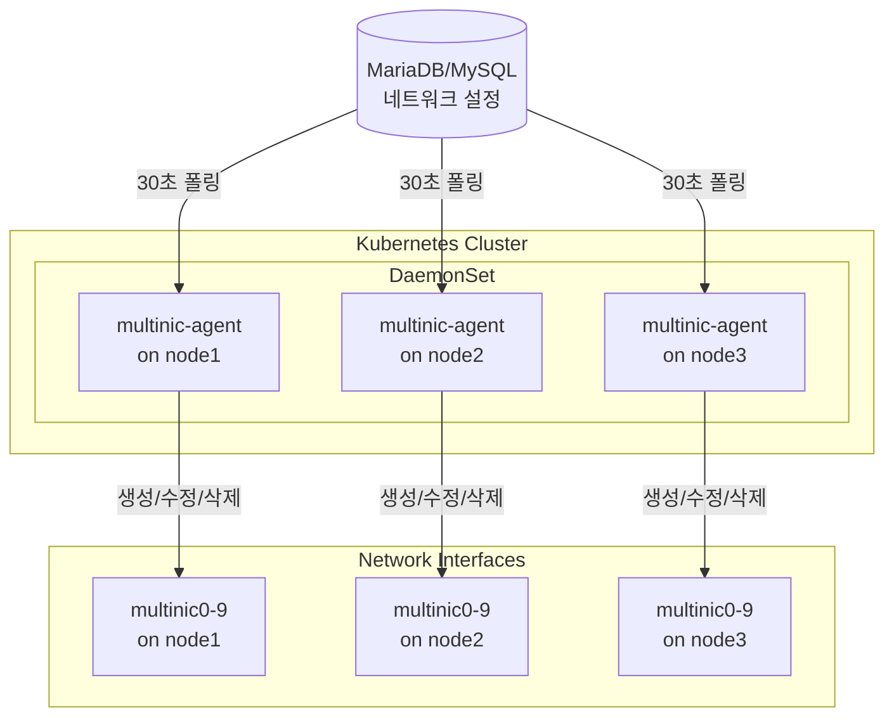
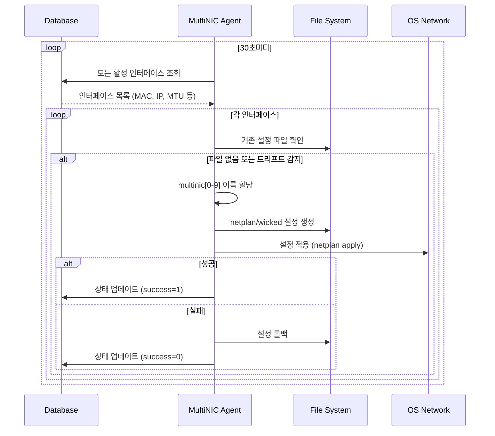
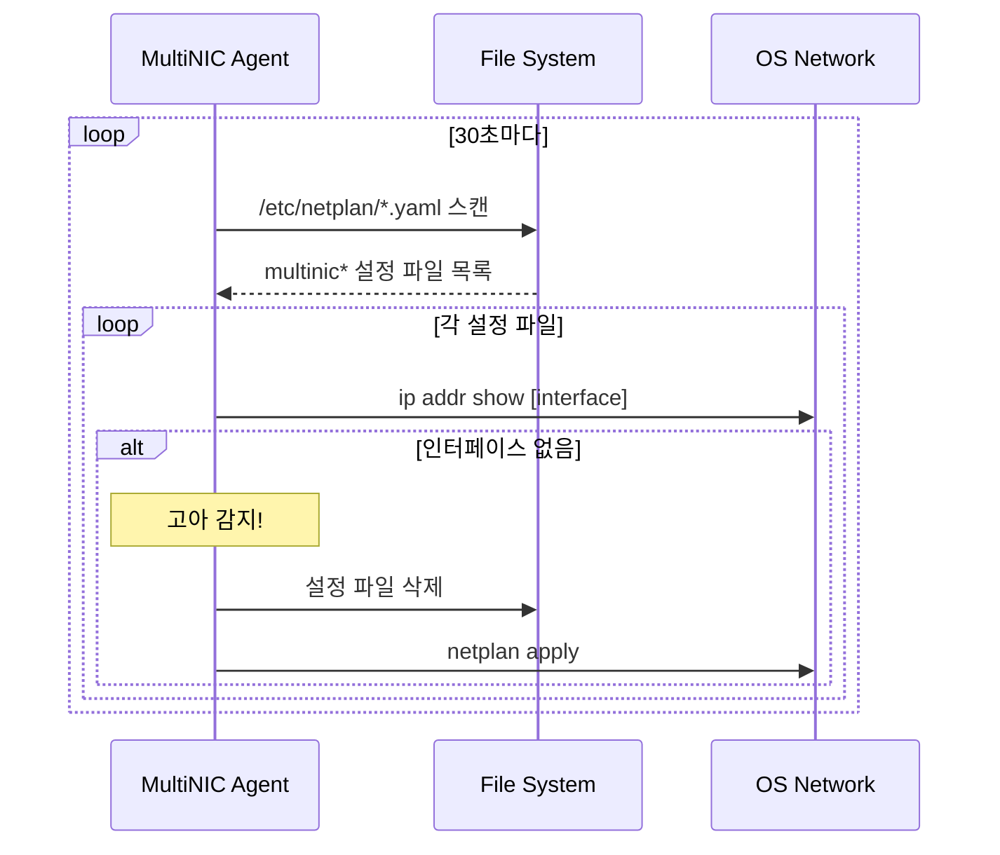

# MultiNIC Agent v2

> **Kubernetes 클러스터 네트워크 인터페이스 완전 자동화 에이전트**

OpenStack 환경에서 다중 네트워크 인터페이스의 **전체 생명주기**를 자동으로 관리하는 지능형 Kubernetes DaemonSet 에이전트입니다.

## 🚀 주요 기능

### 핵심 기능
- **자동 인터페이스 생성**: MAC 주소 기반으로 multinic0~9 인터페이스 자동 생성
- **설정 동기화**: 데이터베이스와 시스템 설정 간 불일치 자동 감지 및 수정
- **고아 인터페이스 정리**: OpenStack에서 삭제된 인터페이스 자동 제거
- **자동 롤백**: 설정 실패 시 이전 상태로 자동 복원
- **다중 OS 지원**: Ubuntu(Netplan) 및 SUSE(Wicked) 지원

### 신규 기능 (v2)
- **구형/신형 netplan 파일 호환**: addresses 필드 유무와 관계없이 동작
- **드리프트 감지 개선**: IP, CIDR, MTU 변경사항 정확히 감지
- **로그 최적화**: 정상 상태에서는 완전히 조용히 동작
- **클린 아키텍처**: 도메인 주도 설계로 확장성과 유지보수성 향상

## 📋 요구사항

### 시스템 요구사항
- Kubernetes 1.19+
- Ubuntu 18.04+ 또는 SUSE Linux 9.4
- MySQL/MariaDB 5.7+

### 개발 요구사항
- Go 1.21+
- Docker 또는 nerdctl
- Helm 3+
- kubectl

## 🏗️ 아키텍처



## 🚀 빠른 시작

### 1. 설정 파일 준비

`deployments/helm/values.yaml` 파일을 실제 환경에 맞게 수정:

```yaml
database:
  host: "192.168.1.100"        # 실제 DB 호스트
  port: "3306"                 # DB 포트
  user: "multinic"             # DB 사용자
  password: "your_password"    # DB 비밀번호
  name: "multinic_db"          # DB 이름

agent:
  pollInterval: "30s"          # 폴링 간격
  logLevel: "info"             # 로그 레벨 (debug/info/warn/error)
```

### 2. 배포

```bash
# SSH 비밀번호 설정
export SSH_PASSWORD="your_ssh_password"

# 배포 실행
./scripts/deploy.sh

# 또는 커스텀 설정으로 배포
NAMESPACE=multinic-prod IMAGE_TAG=v2.0.0 ./scripts/deploy.sh
```

### 3. 상태 확인

```bash
# DaemonSet 상태
kubectl get daemonset -n multinic-system multinic-agent

# Pod 상태
kubectl get pods -n multinic-system -l app.kubernetes.io/name=multinic-agent -o wide

# 로그 확인
kubectl logs -n multinic-system -l app.kubernetes.io/name=multinic-agent -f

# 헬스체크
kubectl port-forward -n multinic-system daemonset/multinic-agent 8080:8080
curl http://localhost:8080/
```

## 🔧 작동 원리

### 인터페이스 생성/수정 프로세스



### 고아 인터페이스 정리 프로세스



## 📊 모니터링

### 헬스체크 엔드포인트

```bash
GET http://localhost:8080/

# 응답 예시
{
  "status": "healthy",
  "uptime": "3h25m10s",
  "processed_vms": 15,
  "failed_configs": 0,
  "database_connected": true,
  "last_sync": "2025-07-10T06:15:30Z"
}
```

### 로그 형식

JSON 구조화 로깅 사용:

```json
{
  "level": "info",
  "msg": "인터페이스 설정 성공",
  "interface_id": 123,
  "interface_name": "multinic0",
  "mac_address": "fa:16:3e:5e:62:3e",
  "time": "2025-07-10T06:15:30Z"
}
```

## 🛠️ 개발

### 프로젝트 구조

```
multinic-agent-v2/
├── cmd/agent/          # 메인 애플리케이션
├── internal/           # 클린 아키텍처
│   ├── domain/         # 비즈니스 로직
│   ├── application/    # 유스케이스
│   ├── infrastructure/ # 외부 시스템 연동
│   └── interfaces/     # HTTP/CLI 인터페이스
├── deployments/        # 배포 설정
│   └── helm/          # Helm 차트
└── scripts/           # 유틸리티 스크립트
```

### 테스트 실행

```bash
# 단위 테스트
go test ./...

# 커버리지 확인
go test ./... -coverprofile=coverage.out
go tool cover -html=coverage.out

# 특정 패키지 테스트
go test ./internal/application/usecases -v
```

### 빌드

```bash
# 로컬 빌드
go build -o multinic-agent ./cmd/agent

# Docker 이미지 빌드
docker build -t multinic-agent:latest .

# Multi-arch 빌드
docker buildx build --platform linux/amd64,linux/arm64 -t multinic-agent:latest .
```

## 🐛 문제 해결

### 에이전트가 시작되지 않을 때

```bash
# Pod 상태 확인
kubectl describe pod -n multinic-system <pod-name>

# 데이터베이스 연결 테스트
kubectl exec -n multinic-system <pod-name> -- nc -zv $DB_HOST $DB_PORT

# 환경 변수 확인
kubectl exec -n multinic-system <pod-name> -- env | grep DB_
```

### 인터페이스가 생성되지 않을 때

1. **호스트네임 확인**: DB의 `attached_node_name`과 일치하는지 확인
2. **MAC 주소 형식**: `00:11:22:33:44:55` 형식인지 확인
3. **로그 확인**: 드리프트 감지 로그 확인

### 고아 인터페이스가 삭제되지 않을 때

```bash
# 삭제 관련 로그 확인
kubectl logs -n multinic-system <pod-name> | grep -i "orphan\|delete"

# 현재 netplan 파일 확인
kubectl exec -n multinic-system <pod-name> -- ls -la /etc/netplan/

# 시스템 인터페이스 확인
kubectl exec -n multinic-system <pod-name> -- ip addr show | grep multinic
```

## 📝 데이터베이스 스키마

```sql
CREATE TABLE multi_interface (
    id INT PRIMARY KEY AUTO_INCREMENT,
    port_id VARCHAR(36) NOT NULL,
    subnet_id VARCHAR(36) NOT NULL,
    macaddress VARCHAR(17) NOT NULL,
    attached_node_name VARCHAR(255),
    netplan_success TINYINT(1) DEFAULT 0,
    address VARCHAR(15),           -- IP 주소 (신규)
    cidr VARCHAR(18),             -- CIDR (신규)
    mtu INT DEFAULT 1500,         -- MTU (신규)
    created_at TIMESTAMP DEFAULT CURRENT_TIMESTAMP,
    modified_at TIMESTAMP DEFAULT CURRENT_TIMESTAMP ON UPDATE CURRENT_TIMESTAMP,
    deleted_at TIMESTAMP NULL
);
```

## 🔒 보안 고려사항

- 데이터베이스 비밀번호는 Kubernetes Secret으로 관리
- 최소 권한 원칙: 에이전트는 필요한 DB 테이블에만 접근
- 네트워크 정책: 필요한 포트만 개방 (8080 for health, DB port)
- 기존 시스템 인터페이스 (eth0, ens* 등) 보호

## 📜 라이선스

이 프로젝트는 MIT 라이선스 하에 배포됩니다. 자세한 내용은 [LICENSE](LICENSE) 파일을 참조하세요.

## 🤝 기여하기

1. Fork the Project
2. Create your Feature Branch (`git checkout -b feature/AmazingFeature`)
3. Commit your Changes (`git commit -m 'Add some AmazingFeature'`)
4. Push to the Branch (`git push origin feature/AmazingFeature`)
5. Open a Pull Request

## 📞 지원

- 이슈 트래커: [GitHub Issues](https://github.com/your-org/multinic-agent-v2/issues)
- 문서: [Wiki](https://github.com/your-org/multinic-agent-v2/wiki)

---

Made with ❤️ by the Infrastructure Team