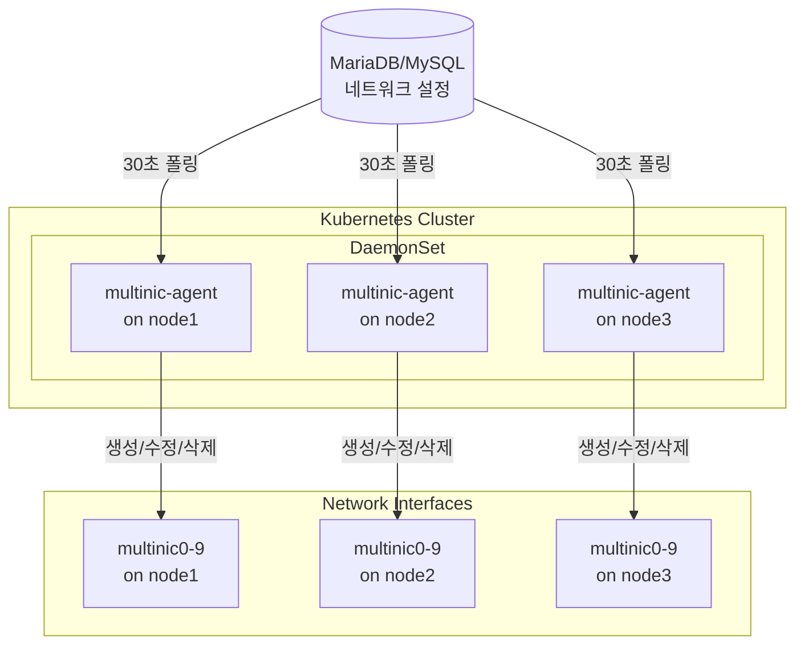
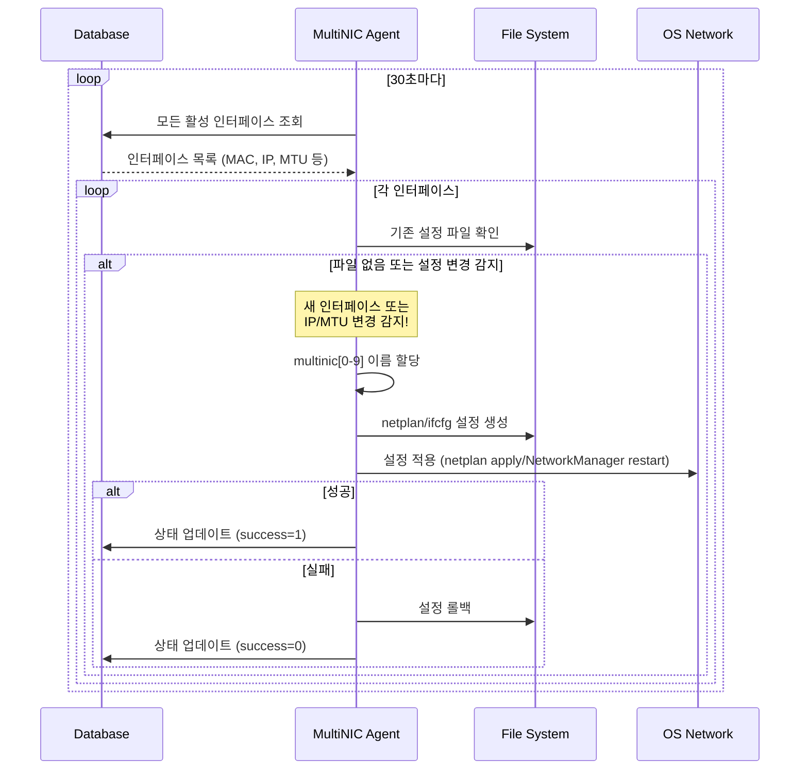
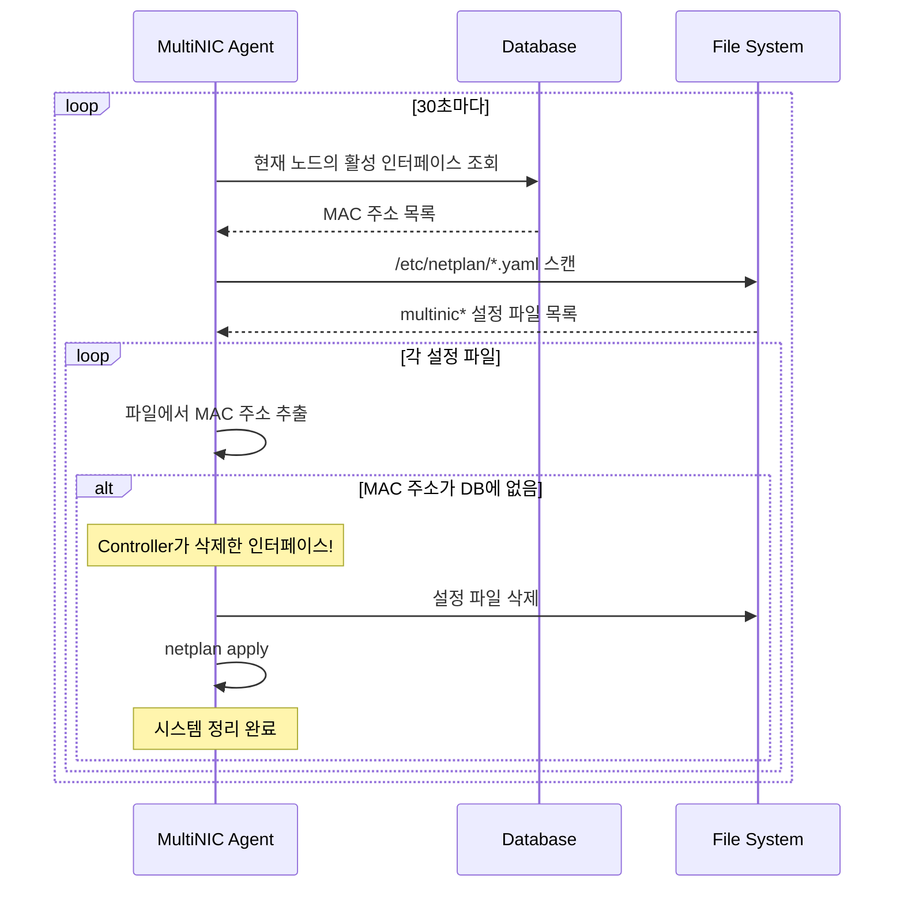

# MultiNIC Agent

> **Kubernetes 클러스터 네트워크 인터페이스 완전 자동화 에이전트**

OpenStack 환경에서 다중 네트워크 인터페이스의 **전체 생명주기**를 자동으로 관리하는 지능형 Kubernetes DaemonSet 에이전트입니다.

## 주요 기능

### 핵심 기능
- **자동 인터페이스 생성**: MAC 주소 기반으로 multinic0~9 인터페이스 자동 생성
- **실시간 설정 동기화**: 데이터베이스의 설정을 시스템에 자동 반영
- **사용하지 않는 인터페이스 자동 정리**: OpenStack에서 삭제된 인터페이스를 시스템에서도 자동 제거
- **안전한 설정 적용**: 설정 실패 시 이전 상태로 자동 복구
- **다중 OS 지원**: Ubuntu(Netplan) 및 RHEL/CentOS(ifcfg) 지원
- **설정 변경 자동 감지**: IP 주소, 네트워크 대역, MTU 등의 변경사항을 실시간으로 감지하고 업데이트

## 요구사항

### 시스템 요구사항
- Kubernetes 1.19+
- Ubuntu 18.04+ 또는 RHEL/CentOS 7+
- MySQL/MariaDB 5.7+

### 개발 요구사항
- Go 1.21+
- Docker 또는 nerdctl
- Helm 3+
- kubectl

## 아키텍처



## 빠른 시작

### 1. 설정 파일 준비

`deployments/helm/values.yaml` 파일을 실제 환경에 맞게 수정:

```yaml
database:
  host: "192.168.1.100"        # 실제 DB 호스트
  port: "3306"                 # DB 포트
  user: "multinic"             # DB 사용자
  password: "your_password"    # DB 비밀번호
  name: "multinic_db"          # DB 이름

agent:
  pollInterval: "30s"          # 폴링 간격
  logLevel: "info"             # 로그 레벨 (debug/info/warn/error)
```

### 2. 배포

```bash
# SSH 비밀번호 설정
export SSH_PASSWORD="your_ssh_password"

# 배포 실행
./scripts/deploy.sh

# 또는 커스텀 설정으로 배포
NAMESPACE=multinic-prod IMAGE_TAG=v2.0.0 ./scripts/deploy.sh
```

### 3. 상태 확인

```bash
# DaemonSet 상태
kubectl get daemonset -n multinic-system multinic-agent

# Pod 상태
kubectl get pods -n multinic-system -l app.kubernetes.io/name=multinic-agent -o wide

# 로그 확인
kubectl logs -n multinic-system -l app.kubernetes.io/name=multinic-agent -f

# 헬스체크
kubectl port-forward -n multinic-system daemonset/multinic-agent 8080:8080
curl http://localhost:8080/
```

## 작동 원리

### 설정 변경 자동 감지

Agent는 매 30초마다 다음 항목들의 변경사항을 감지합니다:
- **IP 주소 변경**: 데이터베이스와 시스템 설정 간 IP 주소 불일치
- **네트워크 대역 변경**: CIDR 표기법으로 정의된 네트워크 범위 변경
- **MTU 변경**: Maximum Transmission Unit 값 변경
- **새 인터페이스**: 데이터베이스에 새로 추가된 인터페이스

변경사항이 감지되면 자동으로 새 설정을 적용하여 시스템을 최신 상태로 유지합니다.

### 인터페이스 생성/수정 프로세스



### 사용하지 않는 인터페이스 자동 정리



## 모니터링

### 헬스체크 엔드포인트

```bash
GET http://localhost:8080/

# 응답 예시
{
  "status": "healthy",
  "uptime": "3h25m10s",
  "processed_vms": 15,
  "failed_configs": 0,
  "database_connected": true,
  "last_sync": "2025-07-10T06:15:30Z"
}
```

### Prometheus 메트릭

에이전트는 `/metrics` 엔드포인트에서 Prometheus 메트릭을 제공합니다:

```bash
GET http://localhost:8080/metrics
```

주요 메트릭:

| 메트릭 이름 | 타입 | 설명 | 레이블 |
|------------|------|------|--------|
| `multinic_interfaces_processed_total` | Counter | 처리된 인터페이스 총 개수 | `status` (success/failed) |
| `multinic_interface_processing_duration_seconds` | Histogram | 인터페이스 처리 소요 시간 | `interface_name`, `status` |
| `multinic_polling_cycles_total` | Counter | 실행된 폴링 사이클 총 개수 | - |
| `multinic_polling_cycle_duration_seconds` | Histogram | 폴링 사이클 소요 시간 | - |
| `multinic_polling_backoff_level` | Gauge | 현재 백오프 레벨 (0=정상) | - |
| `multinic_db_connection_status` | Gauge | DB 연결 상태 (1=연결, 0=끊김) | - |
| `multinic_concurrent_tasks` | Gauge | 동시 처리 중인 작업 수 | - |
| `multinic_configuration_drifts_total` | Counter | 감지된 설정 드리프트 | `drift_type` |
| `multinic_orphaned_interfaces_deleted_total` | Counter | 삭제된 고아 인터페이스 수 | - |
| `multinic_errors_total` | Counter | 발생한 에러 총 개수 | `error_type` |
| `multinic_agent_info` | Gauge | 에이전트 정보 | `version`, `os_type`, `node_name` |

### 로그 형식

JSON 구조화 로깅 사용:

```json
{
  "level": "info",
  "msg": "인터페이스 설정 성공",
  "interface_id": 123,
  "interface_name": "multinic0",
  "mac_address": "fa:16:3e:5e:62:3e",
  "time": "2025-07-10T06:15:30Z"
}
```

## 개발

### 프로젝트 구조

```
multinic-agent/
├── cmd/agent/          # 메인 애플리케이션
├── internal/           # 클린 아키텍처
│   ├── domain/         # 비즈니스 로직
│   ├── application/    # 유스케이스
│   ├── infrastructure/ # 외부 시스템 연동
│   └── interfaces/     # HTTP/CLI 인터페이스
├── deployments/        # 배포 설정
│   └── helm/          # Helm 차트
└── scripts/           # 유틸리티 스크립트
```

### 테스트 실행

```bash
# 단위 테스트
go test ./...

# 커버리지 확인
go test ./... -coverprofile=coverage.out
go tool cover -html=coverage.out

# 특정 패키지 테스트
go test ./internal/application/usecases -v
```

### 빌드

```bash
# 로컬 빌드
go build -o multinic-agent ./cmd/agent

# Docker 이미지 빌드
docker build -t multinic-agent:latest .

# Multi-arch 빌드
docker buildx build --platform linux/amd64,linux/arm64 -t multinic-agent:latest .
```

## OS별 지원 세부사항

### Ubuntu (Netplan 방식)
- **설정 파일 위치**: `/etc/netplan/9X-multinicX.yaml`
- **설정 적용**: `netplan apply` 명령 사용
- **인터페이스 이름 변경**: 가능 (set-name 속성 사용)
- **백업**: `/var/lib/multinic/backups/` 디렉토리에 타임스탬프별 백업
- **지원 버전**: Ubuntu 18.04+

**생성되는 설정 파일 예시**:
```yaml
network:
  version: 2
  ethernets:
    multinic0:
      match:
        macaddress: "fa:16:3e:5e:62:3e"
      set-name: multinic0
      addresses: ["192.168.1.100/24"]
      mtu: 1500
```

### RHEL/CentOS (ifcfg 방식)
- **설정 파일 위치**: `/etc/sysconfig/network-scripts/ifcfg-multinicX`
- **설정 적용**: `systemctl restart NetworkManager` 사용
- **인터페이스 이름 변경**: `ip link set` 명령으로 직접 변경
- **백업**: 파일 삭제 방식으로 롤백
- **지원 버전**: RHEL/CentOS 7+, Rocky Linux, AlmaLinux

**생성되는 설정 파일 예시**:
```bash
DEVICE=multinic0
NAME=multinic0
TYPE=Ethernet
ONBOOT=yes
BOOTPROTO=none
IPADDR=192.168.1.100
PREFIX=24
MTU=1500
HWADDR=fa:16:3e:5e:62:3e
```

### OS별 처리 플로우 차이점

| 항목 | Ubuntu (Netplan) | RHEL/CentOS (ifcfg) |
|------|------------------|---------------------|
| 인터페이스 이름 변경 | netplan의 set-name | ip link set 명령 |
| 설정 파일 형식 | YAML | INI/Shell 형식 |
| 설정 적용 | netplan apply | NetworkManager restart |
| 백업 방식 | 타임스탬프 파일 | 파일 삭제 |
| 안전 모드 | netplan try --timeout=120 | 없음 (즉시 적용) |

## 문제 해결

### 에이전트가 시작되지 않을 때

```bash
# Pod 상태 확인
kubectl describe pod -n multinic-system <pod-name>

# 데이터베이스 연결 테스트
kubectl exec -n multinic-system <pod-name> -- nc -zv $DB_HOST $DB_PORT

# 환경 변수 확인
kubectl exec -n multinic-system <pod-name> -- env | grep DB_
```

### 인터페이스가 생성되지 않을 때

1. **호스트네임 확인**: DB의 `attached_node_name`과 일치하는지 확인
2. **MAC 주소 형식**: `00:11:22:33:44:55` 형식인지 확인
3. **로그 확인**: 설정 변경 감지 및 적용 관련 로그 확인

### 사용하지 않는 인터페이스가 삭제되지 않을 때

```bash
# 삭제 관련 로그 확인
kubectl logs -n multinic-system <pod-name> | grep -i "delete\|삭제\|정리"

# Ubuntu: netplan 파일 확인
kubectl exec -n multinic-system <pod-name> -- ls -la /etc/netplan/

# RHEL/CentOS: ifcfg 파일 확인
kubectl exec -n multinic-system <pod-name> -- ls -la /etc/sysconfig/network-scripts/ifcfg-multinic*

# 시스템 인터페이스 확인
kubectl exec -n multinic-system <pod-name> -- ip addr show | grep multinic
```

## 데이터베이스 스키마

```sql
CREATE TABLE multi_interface (
    id INT PRIMARY KEY AUTO_INCREMENT,
    port_id VARCHAR(36) NOT NULL,
    subnet_id VARCHAR(36) NOT NULL,
    macaddress VARCHAR(17) NOT NULL,
    attached_node_name VARCHAR(255),
    netplan_success TINYINT(1) DEFAULT 0,
    address VARCHAR(15),           -- IP 주소 (신규)
    cidr VARCHAR(18),             -- CIDR (신규)
    mtu INT DEFAULT 1500,         -- MTU (신규)
    created_at TIMESTAMP DEFAULT CURRENT_TIMESTAMP,
    modified_at TIMESTAMP DEFAULT CURRENT_TIMESTAMP ON UPDATE CURRENT_TIMESTAMP,
    deleted_at TIMESTAMP NULL
);
```

## 보안 고려사항

- 데이터베이스 비밀번호는 Kubernetes Secret으로 관리
- 최소 권한 원칙: 에이전트는 필요한 DB 테이블에만 접근
- 네트워크 정책: 필요한 포트만 개방 (8080 for health, DB port)
- 기존 시스템 인터페이스 (eth0, ens* 등) 보호
