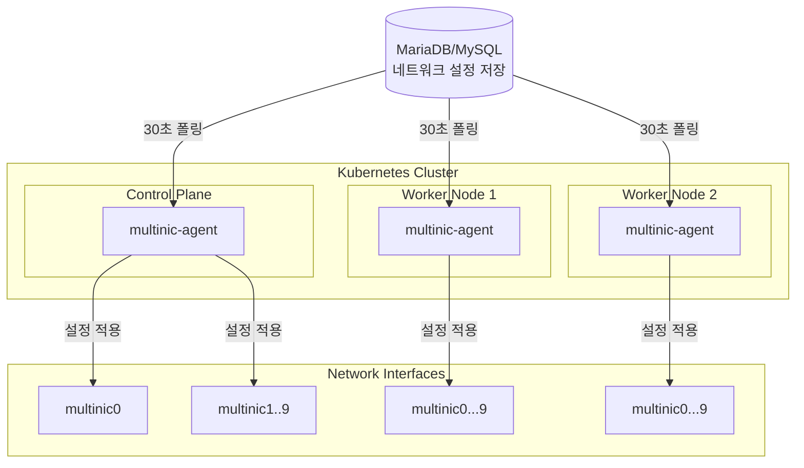
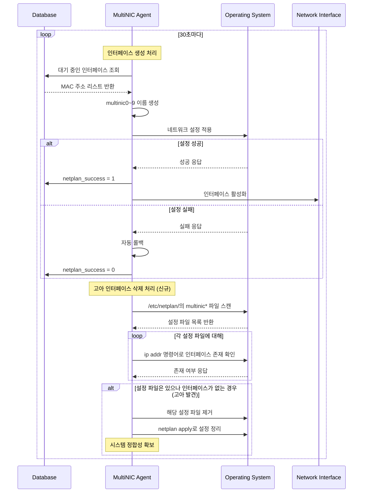

# MultiNIC Controller v0.6.0

> **Kubernetes 클러스터 네트워크 인터페이스 완전 자동화 에이전트**

OpenStack 환경에서 다중 네트워크 인터페이스의 **전체 생명주기**를 자동으로 관리하는 지능형 Kubernetes DaemonSet 에이전트입니다.

## 주요 기능
- 30초마다 데이터베이스를 모니터링하여 네트워크 변경사항 감지(감지 시간은 조절 가능)
- MAC 주소 기반으로 네트워크 인터페이스 **생성/삭제** 자동 처리
- **고아 인터페이스 자동 정리**: OpenStack 삭제 시 시스템에서 자동 제거
- 실패 시 자동 롤백으로 시스템 안정성 보장
- **확장 가능한 구조**로 새로운 OS 지원 용이

## 아키텍처



## 기술 스택

| 분야 | 기술 |
|------|------|
| **언어** | Go 1.21+ |
| **데이터베이스** | MySQL/MariaDB |
| **배포** | Kubernetes DaemonSet |
| **패키징** | Helm Chart |
| **로깅** | logrus (JSON 구조화) |

## 배포 가이드

### 1. 사전 준비
- **필수 도구**: `nerdctl`, `helm`, `kubectl`, `sshpass`가 설치되어 있어야 합니다.
- **DB 정보**: 연결할 데이터베이스의 `host`, `user`, `password`, `name`을 확인해야 합니다.
- **노드 접근**: 스크립트를 실행하는 위치에서 모든 Kubernetes 노드로 SSH 접근이 가능해야 합니다.

### 2. 배포 절차

#### 1단계: `values.yaml` 파일 수정
배포에 필요한 주요 설정은 `deployments/helm/values.yaml` 파일에서 관리합니다. 특히 **데이터베이스 연결 정보는 반드시 실제 환경에 맞게 수정해야 합니다.**

```yaml
# deployments/helm/values.yaml

database:
  host: "10.0.0.100"              # ← 실제 DB 호스트 IP
  port: "3306"                    # ← 실제 DB 포트
  user: "multinic_user"           # ← 실제 DB 사용자명
  password: "your_db_password"    # ← 실제 DB 비밀번호
  name: "multinic_database"       # ← 실제 DB 이름

agent:
  pollInterval: "30s"             # ← 에이전트 폴링 간격
  logLevel: "info"                # ← 로그 레벨 (debug, info, warn, error)
```

#### 2단계: 원클릭 배포 스크립트 실행
`values.yaml` 수정 후, 프로젝트 루트에서 아래 명령어를 실행합니다. 스크립트 실행 시 `SSH_PASSWORD` 환경 변수를 직접 전달해야 합니다.

```bash
# 기본 설정으로 배포
SSH_PASSWORD="your_actual_ssh_password" ./scripts/deploy.sh
```

`IMAGE_TAG`나 `NAMESPACE` 등 다른 변수를 변경하고 싶다면, 아래와 같이 명령어 앞에 추가합니다.

```bash
# 네임스페이스와 이미지 태그를 지정하여 배포
NAMESPACE=multinic-dev IMAGE_TAG=0.6.1 SSH_PASSWORD="your_password" ./scripts/deploy.sh
```

> **중요**: `deploy.sh` 스크립트는 기존에 설치된 Helm 릴리즈를 제거하고 새로 설치하므로 주의가 필요합니다.

### 3. 배포 상태 확인
배포 후 아래 명령어를 사용하여 DaemonSet과 Pod의 상태를 확인할 수 있습니다.

```bash
# DaemonSet 상태 확인
kubectl get daemonset -n <NAMESPACE> -l app.kubernetes.io/name=multinic-agent

# 모든 노드의 Pod 상태 확인
kubectl get pods -n <NAMESPACE> -l app.kubernetes.io/name=multinic-agent -o wide

# 헬스체크 (특정 Pod의 포트를 로컬로 포워딩)
kubectl port-forward <pod-name> -n <NAMESPACE> 8080:8080
curl http://localhost:8080/
```
*(여기서 `<NAMESPACE>`와 `<pod-name>`은 실제 배포 환경에 맞게 변경)*

### 4. 문제 해결
- **로그 확인**: `kubectl logs -f daemonset/multinic-agent -n <NAMESPACE>`
- **Pod 이벤트 확인**: `kubectl describe pod <pod-name> -n <NAMESPACE>`
- **완전 삭제**: `helm uninstall multinic-agent -n <NAMESPACE>`

## 작동 원리



## 지원 환경

### 운영체제
- **Ubuntu 18.04+** (Netplan)
- **SUSE Linux Enterprise 15+** (Wicked)

### 인터페이스 관리
- **최대 10개**: multinic0 ~ multinic9
- **기존 인터페이스 보호**: eth0, ens* 등 건드리지 않음
- **자동 인덱싱**: 사용 가능한 번호 자동 할당

## 설정

### 데이터베이스 연결
```yaml
# values.yaml
database:
  host: "YOUR_DB_HOST"
  port: "YOUR_DB_PORT"
  user: "YOUR_DB_USER"
  password: "YOUR_DB_PASSWORD"
  name: "YOUR_DB_NAME"

agent:
  pollInterval: "30s"
  logLevel: "info"
```

### 테이블 구조
```sql
CREATE TABLE multi_interface (
    id INT PRIMARY KEY AUTO_INCREMENT,
    port_id VARCHAR(36) NOT NULL,
    subnet_id VARCHAR(36) NOT NULL,
    macaddress VARCHAR(17) NOT NULL,
    attached_node_name VARCHAR(255),
    netplan_success TINYINT(1) DEFAULT 0,
    -- 기타 메타데이터 필드들...
);
```

## 모니터링

### 헬스체크 API
```bash
GET http://localhost:8080/

# 응답 예시
{
  "status": "healthy",
  "uptime": "2h45m30s",
  "processed_vms": 42,
  "failed_configs": 0,
  "database_connected": true
}
```

### 로그 모니터링
```bash
# 실시간 로그 확인
kubectl logs -f daemonset/multinic-agent

# 특정 노드 로그
kubectl logs -l app.kubernetes.io/name=multinic-agent \
  --field-selector spec.nodeName=worker-01
```

## 개발 가이드

### 로컬 개발 환경
```bash
# 의존성 설치
go mod download

# 단위 테스트 실행
go test ./internal/... -v

# 커버리지 확인
go test ./internal/... -coverprofile=coverage.out
go tool cover -html=coverage.out
```

### 아키텍처 레이어
```
internal/
├── domain/          # 비즈니스 로직 (순수)
│   ├── entities/    #   도메인 엔티티
│   ├── interfaces/  #   추상화 인터페이스
│   └── services/    #   도메인 서비스
├── application/     # 유스케이스 (오케스트레이션)
├── infrastructure/ # 외부 시스템 연동
└── interfaces/     # 외부 인터페이스
```

## 문제 해결

### 일반적인 이슈

#### 에이전트가 동작하지 않을 때
```bash
# 1. Pod 상태 확인
kubectl describe pod <pod-name>

# 2. 로그 확인
kubectl logs <pod-name>

# 3. 데이터베이스 연결 확인
kubectl exec <pod-name> -- nc -zv $DB_HOST $DB_PORT
```

#### 네트워크 설정이 적용되지 않을 때
```bash
# 1. 호스트네임 확인
kubectl exec <pod-name> -- hostname

# 2. 데이터베이스에서 attached_node_name 확인
# 3. MAC 주소 형식 검증 (00:11:22:33:44:55)
```

#### 고아 인터페이스 삭제 처리 실패
```bash
# 1. 삭제 관련 로그 확인
kubectl logs <pod-name> | grep -i "delete\|orphan"

# 2. 현재 multinic 인터페이스 상태 확인
kubectl exec <pod-name> -- ls /sys/class/net/ | grep multinic

# 3. MAC 주소 확인
kubectl exec <pod-name> -- cat /sys/class/net/multinic*/address

# 4. 삭제 통계 확인 (헬스체크)
kubectl port-forward <pod-name> 8080:8080
curl http://localhost:8080/ | jq '.deleted_interfaces'
```
