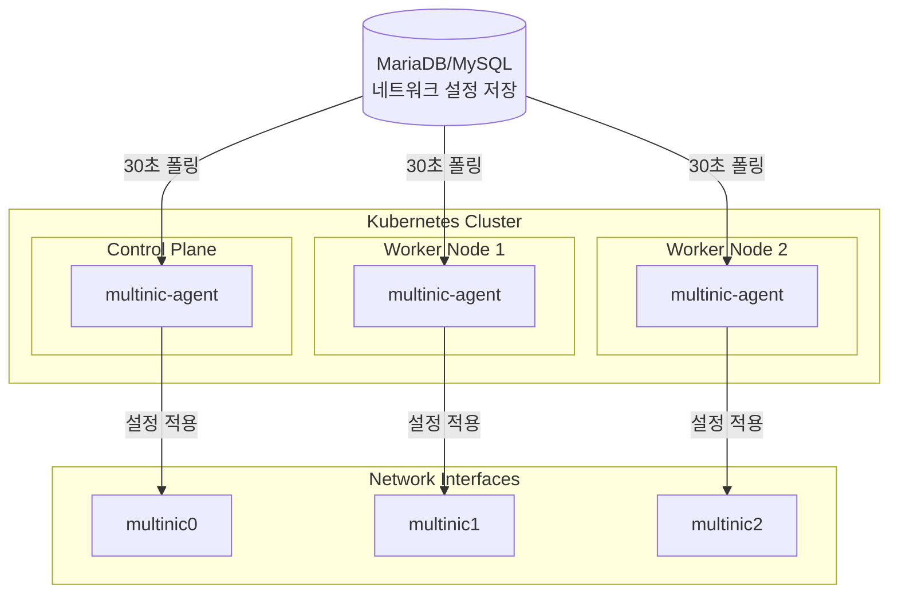
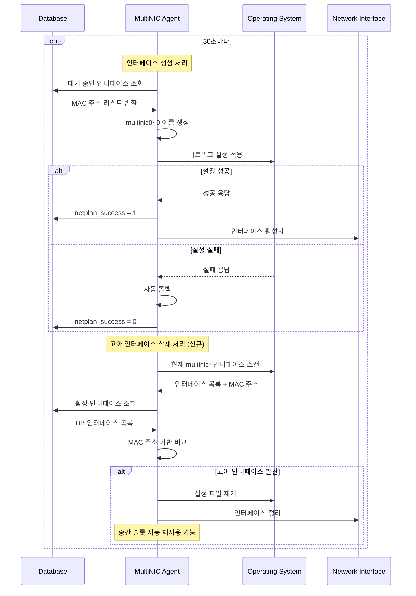

# 🌐 MultiNIC Controller v0.6.0

> **Kubernetes 클러스터 네트워크 인터페이스 완전 자동화 에이전트**

OpenStack 환경에서 다중 네트워크 인터페이스의 **전체 생명주기**를 자동으로 관리하는 지능형 Kubernetes DaemonSet 에이전트입니다.

## ✨ 주요 특징

### 🎯 **완전 자동화**
- 30초마다 데이터베이스를 모니터링하여 네트워크 변경사항 감지
- MAC 주소 기반으로 네트워크 인터페이스 **생성/삭제** 자동 처리
- **고아 인터페이스 자동 정리**: OpenStack 삭제 시 시스템에서 자동 제거
- 실패 시 자동 롤백으로 시스템 안정성 보장

### 🏗️ **클린 아키텍처**
- **도메인 주도 설계**로 비즈니스 로직과 인프라 완전 분리
- **90%+ 테스트 커버리지**로 검증된 안정성
- **확장 가능한 구조**로 새로운 OS 지원 용이

### 🚀 **프로덕션 레디**
- **모든 노드 지원**: 컨트롤 플레인 + 워커 노드
- **실시간 헬스체크**: 포트 8080에서 상태 모니터링
- **구조화된 로깅**: JSON 형식으로 추적 및 디버깅 용이

## 🏛️ 아키텍처



## 🛠️ 기술 스택

| 분야 | 기술 |
|------|------|
| **언어** | Go 1.21+ |
| **아키텍처** | Clean Architecture + DDD |
| **데이터베이스** | MySQL/MariaDB |
| **배포** | Kubernetes DaemonSet |
| **패키징** | Helm Chart |
| **테스트** | testify/mock (90%+ 커버리지) |
| **로깅** | logrus (JSON 구조화) |

## 🚀 배포 가이드

### 🎯 **사전 준비사항**
- **Kubernetes 클러스터**: 1.20+ 버전
- **필수 도구**: nerdctl, helm, kubectl, sshpass
- **권한**: 모든 노드 SSH 접근 권한
- **네트워크**: 클러스터 내 데이터베이스 접근 가능

### 1️⃣ **완전 자동 배포 (권장)**
```bash
# 📦 원클릭 배포 - 모든 단계를 자동으로 수행
./scripts/deploy.sh

# 🔧 커스텀 설정으로 배포
NAMESPACE=production \
IMAGE_TAG=0.6.0 \
SSH_PASSWORD=your_password \
./scripts/deploy.sh
```

**자동 배포 수행 단계:**
1. 🧹 기존 배포 정리
2. 🔧 BuildKit 설정 확인 및 설치
3. ⚙️ containerd 서비스 확인
4. 🛠️ buildkitd 데몬 시작
5. 🔍 필수 도구 확인
6. 📦 이미지 빌드 (nerdctl)
7. 💾 이미지 tar 저장
8. 🚚 **모든 노드에 이미지 배포**
9. 📋 Helm 차트 검증
10. 📁 네임스페이스 생성
11. 🚀 MultiNIC Agent 배포
12. 🔍 DaemonSet Pod 상태 확인
13. 📊 전체 시스템 상태 확인
14. 🩺 헬스체크 수행

### 2️⃣ **수동 Helm 배포**
```bash
# 이미지 빌드
nerdctl --namespace=k8s.io build -t multinic-agent:0.6.0 .

# 모든 노드에 이미지 배포 (각 노드마다 실행)
nerdctl --namespace=k8s.io save multinic-agent:0.6.0 -o multinic-agent.tar
scp multinic-agent.tar node:/tmp/
ssh node "sudo nerdctl --namespace=k8s.io load -i /tmp/multinic-agent.tar"

# Helm 설치
helm install multinic-agent ./deployments/helm \
  --set database.host=YOUR_DB_HOST \
  --set database.password=YOUR_DB_PASSWORD \
  --set image.repository=multinic-agent \
  --set image.tag=0.6.0 \
  --set image.pullPolicy=Never
```

### 3️⃣ **배포 상태 확인**
```bash
# 📊 DaemonSet 상태 확인
kubectl get daemonset -l app.kubernetes.io/name=multinic-agent

# 🔍 모든 노드의 Pod 상태 확인
kubectl get pods -l app.kubernetes.io/name=multinic-agent -o wide

# 📋 노드별 Pod 분포 확인
kubectl get pods -l app.kubernetes.io/name=multinic-agent \
  -o jsonpath='{range .items[*]}{.spec.nodeName}{"\t"}{.metadata.name}{"\t"}{.status.phase}{"\n"}{end}' | column -t

# 🩺 헬스체크
kubectl port-forward <pod-name> 8080:8080
curl http://localhost:8080/
```

### 4️⃣ **환경 변수 설정**
```bash
# 배포 스크립트 환경 변수
export IMAGE_NAME="multinic-agent"
export IMAGE_TAG="0.6.0"
export NAMESPACE="multinic-system"
export RELEASE_NAME="multinic-controller"
export SSH_PASSWORD="your_ssh_password"

# 실행
./scripts/deploy.sh
```

### 5️⃣ **문제 해결**
```bash
# 🔍 Agent 로그 확인
kubectl logs -f daemonset/multinic-agent

# 🔍 특정 노드 Pod 로그 확인
kubectl logs <pod-name> --tail=50

# 🔍 DaemonSet 이벤트 확인
kubectl describe daemonset multinic-agent

# 🗑️ 완전 삭제
helm uninstall multinic-agent
kubectl delete namespace multinic-system
```

### 6️⃣ **고급 배포 옵션**
```bash
# 🔧 개발 환경 배포
NAMESPACE=dev IMAGE_TAG=latest ./scripts/deploy.sh

# 🔧 프로덕션 환경 배포
NAMESPACE=production \
IMAGE_TAG=0.6.0 \
RELEASE_NAME=multinic-prod \
./scripts/deploy.sh

# 🔧 특정 노드만 타겟팅 (tolerations 활용)
helm install multinic-agent ./deployments/helm \
  --set nodeSelector.node-role=multinic-enabled
```

## 💡 작동 원리 (v0.6.0 업데이트)



## 📊 지원 환경

### 운영체제
- ✅ **Ubuntu 18.04+** (Netplan)
- ✅ **SUSE Linux Enterprise 15+** (Wicked)

### 인터페이스 관리
- 🔢 **최대 10개**: multinic0 ~ multinic9
- 🛡️ **기존 인터페이스 보호**: eth0, ens* 등 건드리지 않음
- 🔄 **자동 인덱싱**: 사용 가능한 번호 자동 할당

## 🎛️ 설정

### 데이터베이스 연결
```yaml
# values.yaml
database:
  host: "YOUR_DB_HOST"
  port: "YOUR_DB_PORT"
  user: "YOUR_DB_USER"
  password: "YOUR_DB_PASSWORD"
  name: "YOUR_DB_NAME"

agent:
  pollInterval: "30s"
  logLevel: "info"
```

### 테이블 구조
```sql
CREATE TABLE multi_interface (
    id INT PRIMARY KEY AUTO_INCREMENT,
    port_id VARCHAR(36) NOT NULL,
    subnet_id VARCHAR(36) NOT NULL,
    macaddress VARCHAR(17) NOT NULL,
    attached_node_name VARCHAR(255),
    netplan_success TINYINT(1) DEFAULT 0,
    -- 기타 메타데이터 필드들...
);
```

## 📈 모니터링

### 헬스체크 API
```bash
GET http://localhost:8080/

# 응답 예시
{
  "status": "healthy",
  "uptime": "2h45m30s",
  "processed_vms": 42,
  "failed_configs": 0,
  "database_connected": true
}
```

### 로그 모니터링
```bash
# 실시간 로그 확인
kubectl logs -f daemonset/multinic-agent

# 특정 노드 로그
kubectl logs -l app.kubernetes.io/name=multinic-agent \
  --field-selector spec.nodeName=worker-01
```

## 🔧 개발 가이드

### 로컬 개발 환경
```bash
# 의존성 설치
go mod download

# 단위 테스트 실행
go test ./internal/... -v

# 커버리지 확인
go test ./internal/... -coverprofile=coverage.out
go tool cover -html=coverage.out
```

### 아키텍처 레이어
```
internal/
├── domain/          # 📋 비즈니스 로직 (순수)
│   ├── entities/    #   📄 도메인 엔티티
│   ├── interfaces/  #   🔌 추상화 인터페이스
│   └── services/    #   ⚙️ 도메인 서비스
├── application/     # 🎯 유스케이스 (오케스트레이션)
├── infrastructure/ # 🏗️ 외부 시스템 연동
└── interfaces/     # 🌐 외부 인터페이스
```

## 🐛 문제 해결

### 일반적인 이슈

#### 🔍 에이전트가 동작하지 않을 때
```bash
# 1. Pod 상태 확인
kubectl describe pod <pod-name>

# 2. 로그 확인
kubectl logs <pod-name>

# 3. 데이터베이스 연결 확인
kubectl exec <pod-name> -- nc -zv $DB_HOST $DB_PORT
```

#### 🔍 네트워크 설정이 적용되지 않을 때
```bash
# 1. 호스트네임 확인
kubectl exec <pod-name> -- hostname

# 2. 데이터베이스에서 attached_node_name 확인
# 3. MAC 주소 형식 검증 (00:11:22:33:44:55)
```

#### 🔍 고아 인터페이스 삭제 처리 실패 (v0.6.0 신규)
```bash
# 1. 삭제 관련 로그 확인
kubectl logs <pod-name> | grep -i "delete\|orphan"

# 2. 현재 multinic 인터페이스 상태 확인
kubectl exec <pod-name> -- ls /sys/class/net/ | grep multinic

# 3. MAC 주소 확인
kubectl exec <pod-name> -- cat /sys/class/net/multinic*/address

# 4. 삭제 통계 확인 (헬스체크)
kubectl port-forward <pod-name> 8080:8080
curl http://localhost:8080/ | jq '.deleted_interfaces'
```

## 📋 로드맵

### v0.6.0 (완료) ✅
- [x] **인터페이스 삭제 기능**: 고아 인터페이스 자동 감지 및 삭제
- [x] **MAC 주소 기반 매핑**: 정확한 인터페이스 식별
- [x] **스마트 슬롯 재사용**: 중간 빈 번호 자동 할당
- [x] **완전한 테스트 커버리지**: 삭제 로직 검증

### v0.7.0 (계획)
- [ ] IPv6 지원
- [ ] Prometheus 메트릭 내보내기  
- [ ] 동적 폴링 간격 조정
- [ ] Web UI 대시보드

### v0.8.0 (계획)
- [ ] 고급 네트워크 설정 옵션
- [ ] 인터페이스 수 제한 확장 (20개)
- [ ] 양방향 동기화 지원

## 🤝 기여하기

### 코딩 스타일
- **클린 아키텍처** 원칙 준수
- **테스트 주도 개발** (TDD)
- **의존성 주입** 패턴 사용
- **에러 처리** 철저히

### 커밋 메시지
```
feat: 새로운 기능 추가
fix: 버그 수정
refactor: 코드 리팩터링
docs: 문서 업데이트
test: 테스트 추가/수정
```

## 📄 라이선스

MIT License - 자세한 내용은 [LICENSE](LICENSE) 파일을 참조하세요.

---

<div align="center">

**🚀 MultiNIC Controller로 네트워크 관리를 자동화하세요!**

[](https://goreportcard.com/report/github.com/example/multinic-agent-v2)
[](https://github.com/example/multinic-agent-v2)
[](https://kubernetes.io)

</div>