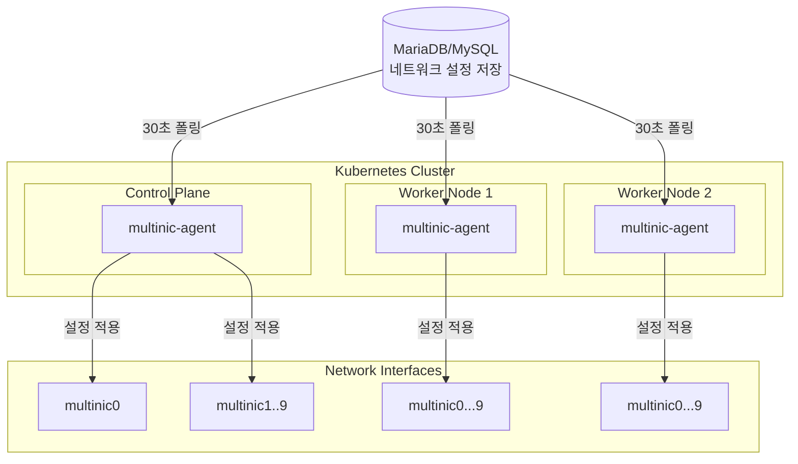
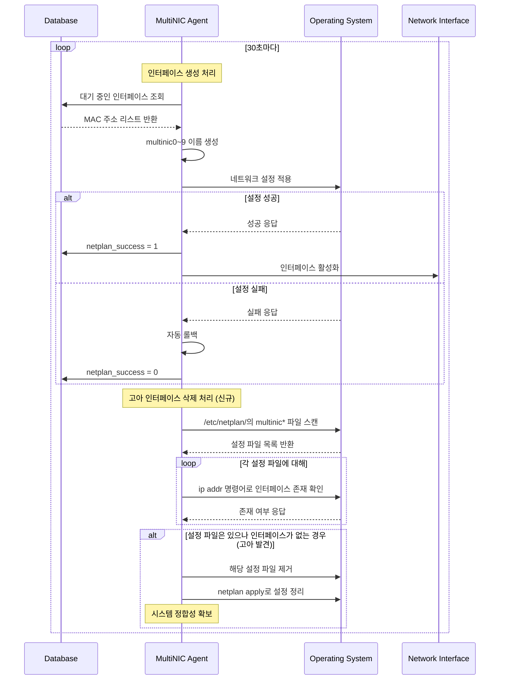

# MultiNIC Controller v0.6.0

> **Kubernetes 클러스터 네트워크 인터페이스 완전 자동화 에이전트**

OpenStack 환경에서 다중 네트워크 인터페이스의 **전체 생명주기**를 자동으로 관리하는 지능형 Kubernetes DaemonSet 에이전트입니다.

## 주요 기능
- 30초마다 데이터베이스를 모니터링하여 네트워크 변경사항 감지(감지 시간은 조절 가능)
- MAC 주소 기반으로 네트워크 인터페이스 **생성/삭제** 자동 처리
- **고아 인터페이스 자동 정리**: OpenStack 삭제 시 시스템에서 자동 제거
- 실패 시 자동 롤백으로 시스템 안정성 보장
- **확장 가능한 구조**로 새로운 OS 지원 용이

## 아키텍처



## 기술 스택

| 분야 | 기술 |
|------|------|
| **언어** | Go 1.21+ |
| **데이터베이스** | MySQL/MariaDB |
| **배포** | Kubernetes DaemonSet |
| **패키징** | Helm Chart |
| **로깅** | logrus (JSON 구조화) |

## 배포 가이드

### **배포 전 필수 설정**

배포하기 전에 다음 정보들을 준비하고 설정 파일을 수정해야 합니다:

#### 1. SSH 접근 정보 설정
```bash
# deploy.sh에서 사용할 SSH 비밀번호
export SSH_PASSWORD="your_actual_ssh_password"
```

#### 2. 데이터베이스 연결 정보 설정
`/deployments/helm/values.yaml` 파일을 수정하세요:

```yaml
# 수정 필요한 부분
database:
  host: "10.0.0.100"              # ← 실제 DB 호스트 IP
  port: "3306"                    # ← 실제 DB 포트 
  user: "multinic_user"           # ← 실제 DB 사용자명
  password: "your_db_password"    # ← 실제 DB 비밀번호
  name: "multinic_database"       # ← 실제 DB 이름

agent:
  pollInterval: "30s"             # ← 원하는 폴링 간격 (기본: 30초)
  logLevel: "info"                # ← 로그 레벨 (debug/info/warn/error)
```

#### 3. 빠른 설정 체크리스트
- [ ] SSH 비밀번호 확인 및 모든 노드 접근 가능 확인
- [ ] DB 호스트 IP 및 포트 확인
- [ ] DB 사용자명/비밀번호 확인  
- [ ] DB 이름 확인
- [ ] 폴링 간격 결정 (기본 30초 권장)
- [ ] values.yaml 파일 수정 완료

### **사전 준비사항**
- **필수 도구**: nerdctl, helm, kubectl, sshpass
- **권한**: 모든 노드 SSH 접근 권한
- **네트워크**: 클러스터 내 데이터베이스 접근 가능

### 1. **원클릭 배포 (권장)**
```bash
# 1단계: SSH 비밀번호 설정
export SSH_PASSWORD="your_actual_ssh_password"

# 2단계: values.yaml 수정 완료 후 배포 실행
./scripts/deploy.sh

# 또는 환경변수로 모든 설정을 한번에 지정
NAMESPACE=multinic-system \
IMAGE_TAG=0.6.0 \
SSH_PASSWORD=your_password \
./scripts/deploy.sh
```

> **중요**: 배포 전에 반드시 `deployments/helm/values.yaml`에서 DB 설정을 수정하세요!

### 2. **수동 Helm 배포**
```bash
# 이미지 빌드
nerdctl --namespace=k8s.io build -t multinic-agent:0.6.0 .

# 모든 노드에 이미지 배포 (각 노드마다 실행)
nerdctl --namespace=k8s.io save multinic-agent:0.6.0 -o multinic-agent.tar
scp multinic-agent.tar node:/tmp/
ssh node "sudo nerdctl --namespace=k8s.io load -i /tmp/multinic-agent.tar"

# Helm 설치
helm install multinic-agent ./deployments/helm \
  --set database.host=YOUR_DB_HOST \
  --set database.password=YOUR_DB_PASSWORD \
  --set image.repository=multinic-agent \
  --set image.tag=0.6.0 \
  --set image.pullPolicy=Never
```

### 3.**배포 상태 확인**
```bash
# DaemonSet 상태 확인
kubectl get daemonset -l app.kubernetes.io/name=multinic-agent

# 모든 노드의 Pod 상태 확인
kubectl get pods -l app.kubernetes.io/name=multinic-agent -o wide

# 노드별 Pod 분포 확인
kubectl get pods -l app.kubernetes.io/name=multinic-agent \
  -o jsonpath='{range .items[*]}{.spec.nodeName}{"\t"}{.metadata.name}{"\t"}{.status.phase}{"\n"}{end}' | column -t

# 헬스체크
kubectl port-forward <pod-name> 8080:8080
curl http://localhost:8080/
```

### 4.**환경 변수 설정**
```bash
# 배포 스크립트 환경 변수
export IMAGE_NAME="multinic-agent"
export IMAGE_TAG="0.6.0"
export NAMESPACE="multinic-system"
export RELEASE_NAME="multinic-controller"
export SSH_PASSWORD="your_ssh_password"

# 실행
./scripts/deploy.sh
```

### 5.**문제 해결**
```bash
# Agent 로그 확인
kubectl logs -f daemonset/multinic-agent

# 특정 노드 Pod 로그 확인
kubectl logs <pod-name> --tail=50

# DaemonSet 이벤트 확인
kubectl describe daemonset multinic-agent

# 완전 삭제
helm uninstall multinic-agent
kubectl delete namespace multinic-system
```

### 6.**고급 배포 옵션**
```bash
# 개발 환경 배포
NAMESPACE=dev IMAGE_TAG=latest ./scripts/deploy.sh

# 프로덕션 환경 배포
NAMESPACE=production \
IMAGE_TAG=0.6.0 \
RELEASE_NAME=multinic-prod \
./scripts/deploy.sh

# 특정 노드만 타겟팅 (tolerations 활용)
helm install multinic-agent ./deployments/helm \
  --set nodeSelector.node-role=multinic-enabled
```

### 7.**실제 배포 예시**
```bash
# 실제 환경 예시 - 이 값들을 실제 환경에 맞게 수정하세요
export SSH_PASSWORD="mypassword123"

# values.yaml 파일 수정 예시:
# database:
#   host: "10.1.1.100"
#   port: "3306" 
#   user: "multinic_user"
#   password: "dbpass123"
#   name: "openstack_multinic"
# agent:
#   pollInterval: "30s"
#   logLevel: "info"

# 배포 실행
./scripts/deploy.sh

# 배포 확인
kubectl get pods -l app.kubernetes.io/name=multinic-agent -o wide
```

## 작동 원리



## 지원 환경

### 운영체제
- **Ubuntu 18.04+** (Netplan)
- **SUSE Linux Enterprise 15+** (Wicked)

### 인터페이스 관리
- **최대 10개**: multinic0 ~ multinic9
- **기존 인터페이스 보호**: eth0, ens* 등 건드리지 않음
- **자동 인덱싱**: 사용 가능한 번호 자동 할당

## 설정

### 데이터베이스 연결
```yaml
# values.yaml
database:
  host: "YOUR_DB_HOST"
  port: "YOUR_DB_PORT"
  user: "YOUR_DB_USER"
  password: "YOUR_DB_PASSWORD"
  name: "YOUR_DB_NAME"

agent:
  pollInterval: "30s"
  logLevel: "info"
```

### 테이블 구조
```sql
CREATE TABLE multi_interface (
    id INT PRIMARY KEY AUTO_INCREMENT,
    port_id VARCHAR(36) NOT NULL,
    subnet_id VARCHAR(36) NOT NULL,
    macaddress VARCHAR(17) NOT NULL,
    attached_node_name VARCHAR(255),
    netplan_success TINYINT(1) DEFAULT 0,
    -- 기타 메타데이터 필드들...
);
```

## 모니터링

### 헬스체크 API
```bash
GET http://localhost:8080/

# 응답 예시
{
  "status": "healthy",
  "uptime": "2h45m30s",
  "processed_vms": 42,
  "failed_configs": 0,
  "database_connected": true
}
```

### 로그 모니터링
```bash
# 실시간 로그 확인
kubectl logs -f daemonset/multinic-agent

# 특정 노드 로그
kubectl logs -l app.kubernetes.io/name=multinic-agent \
  --field-selector spec.nodeName=worker-01
```

## 개발 가이드

### 로컬 개발 환경
```bash
# 의존성 설치
go mod download

# 단위 테스트 실행
go test ./internal/... -v

# 커버리지 확인
go test ./internal/... -coverprofile=coverage.out
go tool cover -html=coverage.out
```

### 아키텍처 레이어
```
internal/
├── domain/          # 비즈니스 로직 (순수)
│   ├── entities/    #   도메인 엔티티
│   ├── interfaces/  #   추상화 인터페이스
│   └── services/    #   도메인 서비스
├── application/     # 유스케이스 (오케스트레이션)
├── infrastructure/ # 외부 시스템 연동
└── interfaces/     # 외부 인터페이스
```

## 문제 해결

### 일반적인 이슈

#### 에이전트가 동작하지 않을 때
```bash
# 1. Pod 상태 확인
kubectl describe pod <pod-name>

# 2. 로그 확인
kubectl logs <pod-name>

# 3. 데이터베이스 연결 확인
kubectl exec <pod-name> -- nc -zv $DB_HOST $DB_PORT
```

#### 네트워크 설정이 적용되지 않을 때
```bash
# 1. 호스트네임 확인
kubectl exec <pod-name> -- hostname

# 2. 데이터베이스에서 attached_node_name 확인
# 3. MAC 주소 형식 검증 (00:11:22:33:44:55)
```

#### 고아 인터페이스 삭제 처리 실패
```bash
# 1. 삭제 관련 로그 확인
kubectl logs <pod-name> | grep -i "delete\|orphan"

# 2. 현재 multinic 인터페이스 상태 확인
kubectl exec <pod-name> -- ls /sys/class/net/ | grep multinic

# 3. MAC 주소 확인
kubectl exec <pod-name> -- cat /sys/class/net/multinic*/address

# 4. 삭제 통계 확인 (헬스체크)
kubectl port-forward <pod-name> 8080:8080
curl http://localhost:8080/ | jq '.deleted_interfaces'
```
